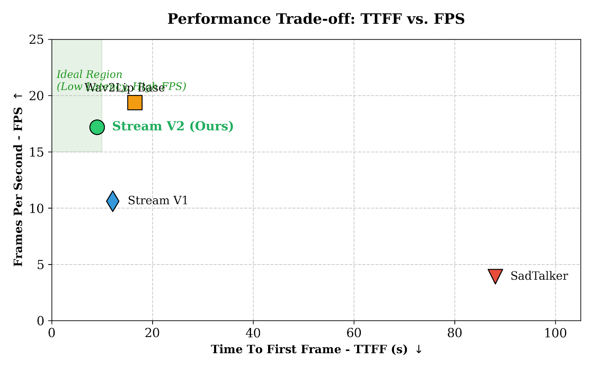

# Native In-Memory Streaming for Low-Latency Audio-Driven Conversational Avatars

[](#) [](https://www.python.org/downloads/)
[](https://opensource.org/licenses/MIT)

This repository contains the official implementation of the paper: **"Native In-Memory Streaming for Low-Latency Audio-Driven Conversational Avatars"**.

## 📖 Abstract
Recent advancements in audio-driven talking head generation have yielded impressive results. However, most existing methods require offline batch processing of the entire input audio, resulting in significant Time To First Frame (TTFF) latency and disrupting real-time communication experiences. 

In this work, we propose a low-latency conversational avatar architecture achieved through comprehensive pipeline optimization and a novel video rendering mechanism. Our **Native In-Memory Streaming (Stream V2)** mechanism for the Wav2Lip model completely eradicates disk I/O overhead and GPU memory fragmentation. Our system reduces the TTFF to under 5 seconds and achieves a frame rate of >15 FPS, significantly outperforming traditional baseline systems.

<p align="center">
  
</p>

## 🚀 Features
- **4-Stage Optimized Pipeline**: Integrates Faster-Whisper (ASR), Qwen2.5-7B (LLM), Edge-TTS, and Wav2Lip (Visual Rendering).
- **Native In-Memory Streaming (Stream V2)**: Bypasses sub-processes, processing audio chunks directly in RAM/VRAM for ultra-low latency.
- **Comprehensive Benchmarking Tools**: Built-in scripts to measure TTFF, FPS, and evaluate Lip-Sync Error (LSE-D, LSE-C) via SyncNet.

## 📂 Repository Structure

```text
.
├── assets/                       # Sample inputs (source images, test audio prompts)
├── figures/                      # Qualitative comparison frames and charts
├── outputs/                      # Generated video chunks and final streams
├── SadTalker/                    # SadTalker baseline implementation
├── Wav2Lip/                      # Wav2Lip offline baseline implementation
├── syncnet_python/               # SyncNet evaluation framework
├── core_config.py                # Global configurations and path settings
├── core_models.py                # Wrapper for ASR, LLM, and TTS models
├── core_wav2lip.py               # Native in-memory streaming logic for Wav2Lip
├── pipelines.py                  # End-to-end pipeline execution scripts
├── run_benchmark.py              # Script to benchmark TTFF and FPS across models
├── benchmark_report.py           # Generates CSV reports from benchmark logs
├── run_syncnet_eval.py           # Evaluates LSE-D and LSE-C metrics
├── extract_frames.py             # Extracts temporal frames for qualitative analysis
└── requirements.txt              # Python dependencies
```

## ⚙️ Installation

**1. Clone the repository & create a virtual environment:**
```bash
git clone [https://github.com/lee-vtruong/Native-Streaming-Avatar.git](https://github.com/lee-vtruong/Native-Streaming-Avatar.git)
cd Native-Streaming-Avatar
python -m venv .venv
source .venv/bin/activate  # On Windows: .venv\Scripts\activate
```

**2. Install dependencies:**
```bash
pip install -r requirements.txt
```

**3. Download Pre-trained Weights:**
- Place the Wav2Lip and SyncNet checkpoints in `Wav2Lip/checkpoints/` and `syncnet_python/data/` respectively.
- Follow the instructions in the `SadTalker/` directory to download its 3DMM and rendering weights.

## 🏃‍♂️ Usage

### 1. End-to-End Benchmarking (TTFF & FPS)
To evaluate the system latency and throughput across different models (SadTalker, Base, Stream V1, Stream V2):
```bash
python run_benchmark.py
```
*Results will be saved in `benchmark_ttff_fps_FINAL.csv`.*

### 2. SyncNet Evaluation (LSE-D & LSE-C)
To calculate the objective lip-sync accuracy of the generated videos:
```bash
python run_syncnet_eval.py
```
*Results will be saved in `benchmark_syncnet_lse.csv`.*

### 3. Qualitative Extraction
To extract specific frames for side-by-side visual comparison (e.g., checking for "fused-teeth" artifacts):
```bash
python extract_frames.py
```

## 📊 Main Results
Our empirical and subjective (MOS, $N=130$) evaluations confirm the superiority of Stream V2 in real-time constraints:

| Method | TTFF (s) ↓ | FPS ↑ | MOS (Lip-sync) ↑ | MOS (Naturalness) ↑ |
| :--- | :---: | :---: | :---: | :---: |
| SadTalker | 88.03 | 3.91 | 3.45 ± 0.23 | 2.62 ± 0.21 |
| Wav2Lip Base | 16.53 | 19.36 | 3.68 ± 0.20 | 3.26 ± 0.20 |
| Stream V1 | 12.10 | 10.61 | 3.82 ± 0.19 | 3.08 ± 0.20 |
| **Stream V2 (Ours)** | **8.99** | **17.19** | **3.94 ± 0.17** | **3.51 ± 0.20** |

## 📝 Citation
If you find our work useful in your research, please consider citing:

```bibtex
@inproceedings{le2026native,
  title={Native In-Memory Streaming for Low-Latency Audio-Driven Conversational Avatars},
  author={Le, Van-Truong and Phan, Trung-Nhut and Tran, Minh-Triet and Huynh, Viet-Tham},
  booktitle={...}, % To be updated
  year={2026}
}
```

## 🙏 Acknowledgments
We express our sincere gratitude to the Faculty of Information Technology at the University of Science, VNU-HCM for providing the computational resources. We also acknowledge the open-source contributions of Faster-Whisper, Qwen, Edge-TTS, and Wav2Lip.
```